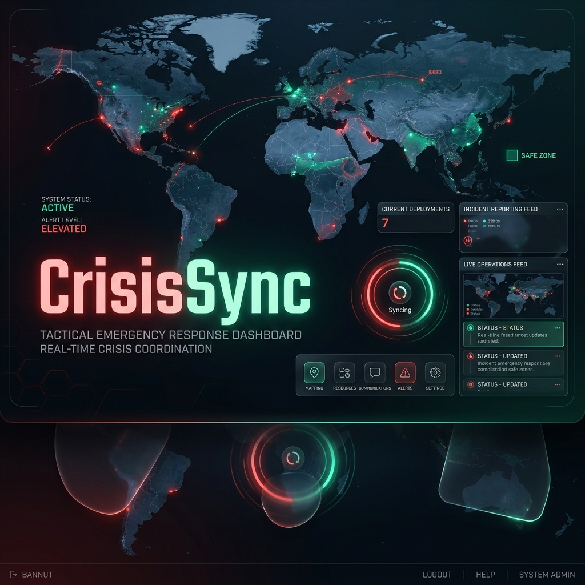

<div align="center">



# 🚨 CrisisSync
### *Tactical Emergency Response & Synchronization System*

[](https://reactjs.org/)
[](https://vitejs.dev/)
[](https://firebase.google.com/)
[](https://tailwindcss.com/)
[](https://opensource.org/licenses/Apache-2.0)

---

**CrisisSync** is a high-performance, mission-critical tactical response platform designed for real-time emergency coordination and personnel safety monitoring. Built with a focus on speed, reliability, and multi-lingual accessibility.

[View on AI Studio](https://ai.studio/apps/6f4d0840-1fec-4204-8f94-4d63775de45c)

</div>

## 🎯 Key Features

- **🔴 Tactical SOS Broadcast**: Instant, high-priority emergency signal transmission with neural link relay simulation.
- **🗺️ Live Tactical Mapping**: Real-time tracking of incidents and personnel via interactive Leaflet-powered maps.
- **⚡ Crisis Nodes**: Rapid discovery of essential tactical points (Hospitals, Safe Zones, Police Stations).
- **🤖 AI-Powered Support**: Integrated Gemini AI assistance for emergency protocols and real-time guidance.
- **🌐 Global Synchronization**: Full multi-lingual support (English, Hindi, Bengali, Spanish, Japanese, Chinese) for international operations.
- **📱 Smart Notifications**: FCM-powered push notifications for immediate situational awareness.

## 🛠️ Technology Stack

- **Frontend**: React 19, Vite 6, TailwindCSS 4, Framer Motion
- **Backend**: Node.js, Express, Firebase (Auth, Firestore, Messaging)
- **AI**: Google Generative AI (Gemini 1.5 Flash), OpenRouter Integration
- **Maps**: Leaflet, Mapbox API, OSRM

## 🔌 API Endpoints

- `POST /api/ai`: AI Protocol Generation Pipeline (Gemini/OpenRouter)
- `GET /api/route`: Tactical Routing Engine (Mapbox/OSRM fallback)

## ⚙️ Environment Variables

To run this project, you will need to add the following environment variables to your `.env.local` file:

```env
GEMINI_API_KEY=your_gemini_api_key
OPENROUTER_API_KEY=optional_openrouter_key
MAPBOX_ACCESS_TOKEN=optional_mapbox_token
```

## 🚀 Getting Started

### Prerequisites

- [Node.js](https://nodejs.org/) (v18+)
- [Firebase Project](https://console.firebase.google.com/)

### Installation

1. **Clone the repository:**
   ```bash
   git clone https://github.com/asmitpaul-vs/CrysisSync.git
   cd CrysisSync
   ```

2. **Install dependencies:**
   ```bash
   npm install
   ```

3. **Configure Firebase:**
   Ensure your `firebase-env.json` is correctly configured with your Firebase project credentials.

4. **Launch Dev Server:**
   ```bash
   npm run dev
   ```

## 🛡️ License

Distributed under the Apache 2.0 License. See `LICENSE` for more information.

---

<div align="center">
Built with ❤️ for the Hackathon
</div>
